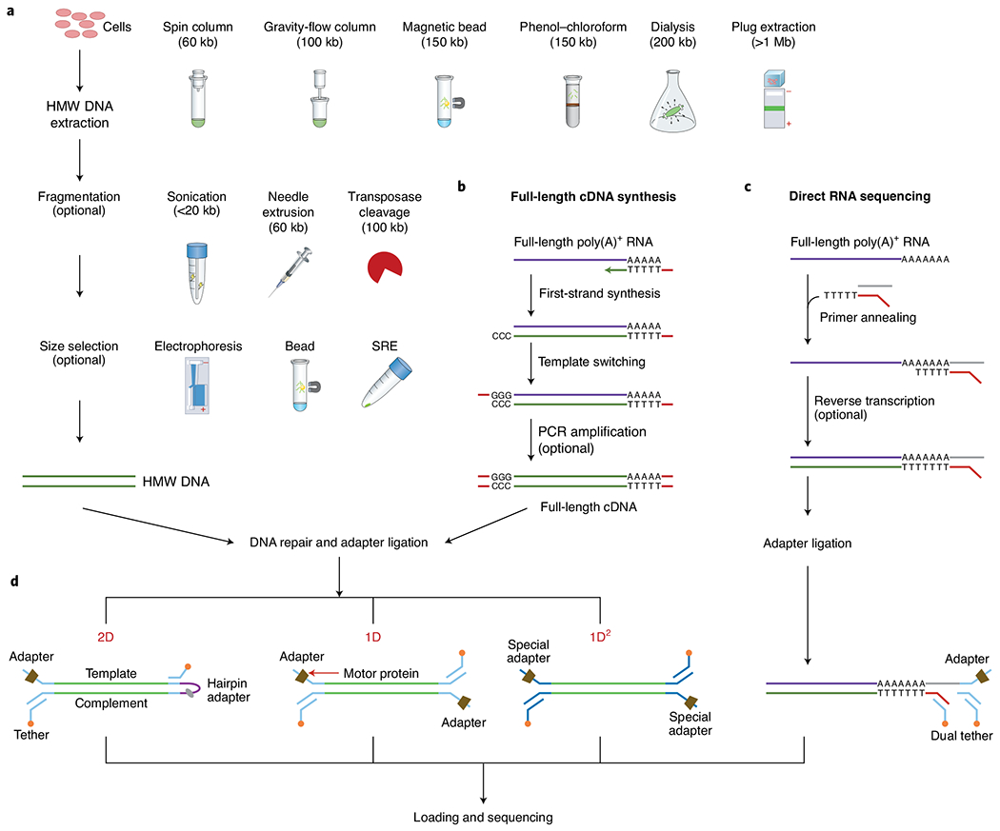
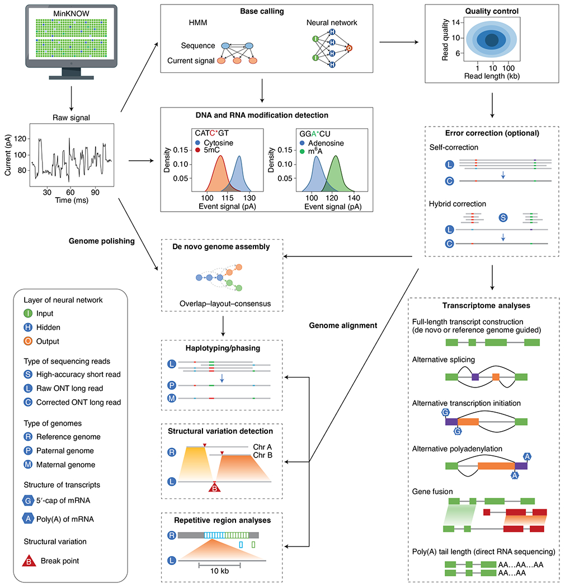
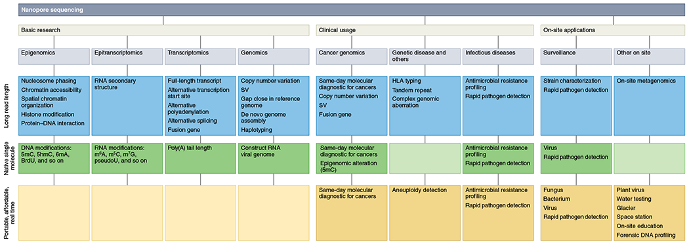

# Research Digest #001 130726 Nanopore Sequencing

**Date:** 130726  
**Paper:**  Nanopore sequencing technology, bioinformatics and applications
**Journal:**  Nat Biotechnol. 2021 Nov 8;39(11):1348–1365. 
**Link/DOI:**  doi: 10.1038/s41587-021-01108-x 

---

## TL;DR
A sequencing technique that uses a nanoscale protein pore and serves as a biosenser that is embedded in an electrically resistant polymer membrane

---

## Key Takeaways
- Applied voltage causes negatively charged ssDNA or RNA to be driven from the negatively charged 'cis' side to the positively charged 'trans' side
- the protein also has helicase activity, unwinding the double stranded molecules
- Some use cases include expansion of reference genomes like E.coli, Arabidopsis and more model organisms
- Nanopore Sequencing also is used for rapid pathogen detection ;16S amplicon sequencing took only 10 minutes using MinION to identify pathogenic bacteria in all six retrospective cases.

---

## My Thoughts
One of the sequencing methods that is currently done for the project of my internship program. An interesting piece of technology, would need to read more on it to understand it further. 

---

## Tags
#Genomics #Nanopore #AI

