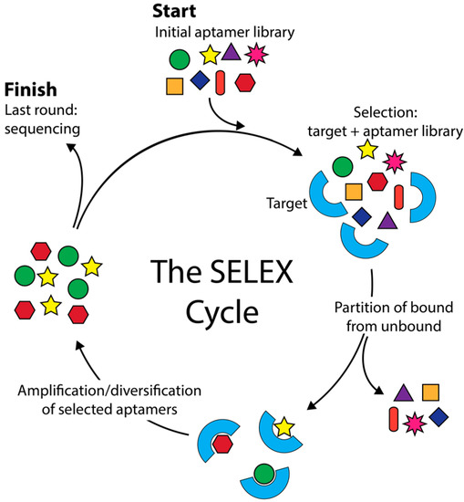

# Biotech Digest #003 Aptamer Bioinformatics

**Date:** 140726 
**Paper:**  Aptamer Bioinformatics 
**Journal:**  Int. J. Mol. Sci. 2017, 18(12), 2516; 
**Link/DOI:**  https://doi.org/10.3390/ijms18122516

---

## TL;DR
Aptamers are short short nucleic acid sequences capable of specific, high-affinity molecular binding. This study discussed the bioinformatic applications for optimizing said Aptamer production.
SELEX (Systematic Evolution of Ligands by Exponential Enrichment)

---

## Key Takeaways
- Aptamers are isolated via a process involving rounds of selection and amplification before sequencing and characterization.
- Considered among the simplest of genetic entities while having genotypic and phenotypic properties and the capable of heredity in an in vitro setting.  
- For decades now, In silico approaces have been used for interactions between macromolecules.
- Interaction are categorized and assigned scores in order to distinguish between the spectrum of binding interactions.
-HTS technology shown to improve SELEX to identify optimal aptamer sequences.

---

## My Thoughts
First of all, I am way too underqualified to read this but I'll try. Aptamers were the topic of talks in the office so I became curious. Also I know this is an old paper. Read the year a bit too late. The concept is interesting, especially its application in medicine specifically personalized medicine as its high-affinity binding could help in being receptor, signal or substrate blockers or enhancers.
---

## Tags
#Aptamer #in-silico selection #Bioinformatics

